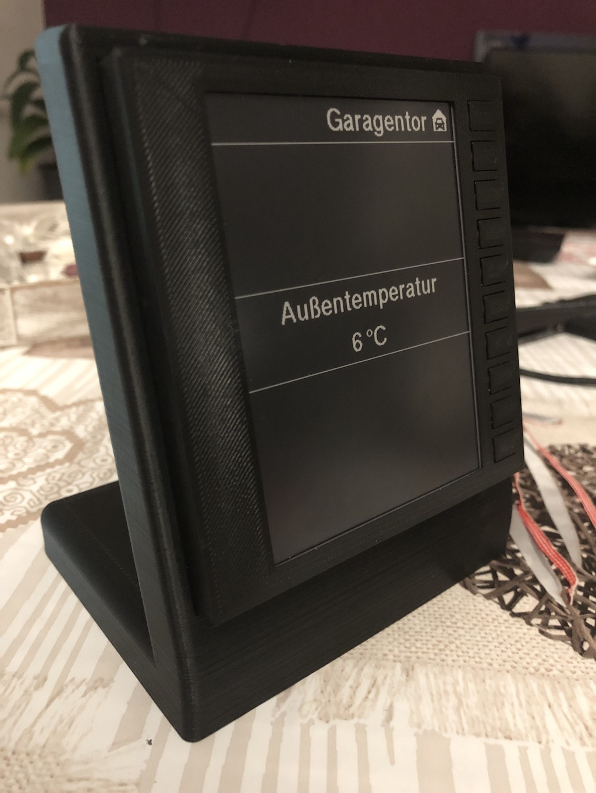

# HB-Dis-EP-42BW

## Parts
- ATMega **1284P** (für den [Prototypen](https://github.com/jp112sdl/HB-Dis-EP-42BW/blob/master/Images/IMG_9180.jpg) habe ich die [HM-ES-PWMSw1-Pl_GosundSP1-Platine](https://raw.githubusercontent.com/stan23/HM-ES-PMSw1-Pl_GosundSP1/master/Bilder/Platine_V2_bestückt.jpg) missbraucht ^^)
- 11 Taster (10 Tasterkanäle + 1 Anlerntaster)
- 2 Widerstände 330 Ohm
- 2 LEDs oder 1 Dual-Color-LED
- 4.2" ePaper Display
  - [mit SPI Interface](https://www.exp-tech.de/new/8289/400x300-4.2-e-ink-display-module), passt dann jedoch nicht in die [Frontabdeckung](Images/ePaper-Front.stl) - da ist dann eigene Kreativität gefragt
  - [mit RAW Interface](https://www.exp-tech.de/displays/e-paper-e-ink/8885/waveshare-4.2-e-ink-raw-display-400x300), setzt jedoch noch ein SPI-Treiberboard voraus
    - [Universal e-Paper Raw Panel Driver HAT](https://www.exp-tech.de/displays/e-paper-e-ink/8525/universal-e-paper-raw-panel-driver-hat) oder
    - [CrystalFontz ePaper Adapter Board](https://www.crystalfontz.com/product/cfa10084-epaper-adapter-board)
- 2x 2fach AAA Batteriehalter (werden parallel betrieben; passte am besten ins [Gehäuse](https://github.com/jp112sdl/HB-Dis-EP-42BW/blob/master/Images/IMG_9181.jpg))    

## Arduino

## Gehäuse
### Stand
https://www.thingiverse.com/thing:3331473

### Front
[Front](Images/ePaper-Front.stl)
